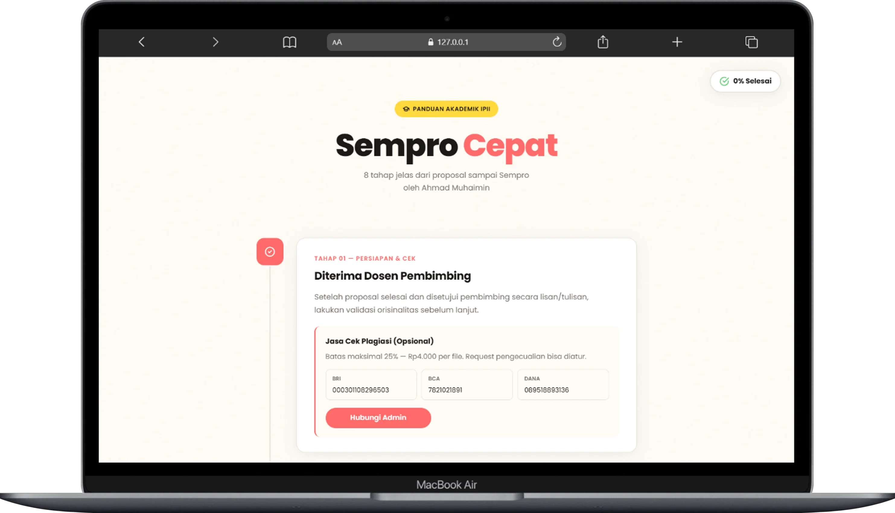
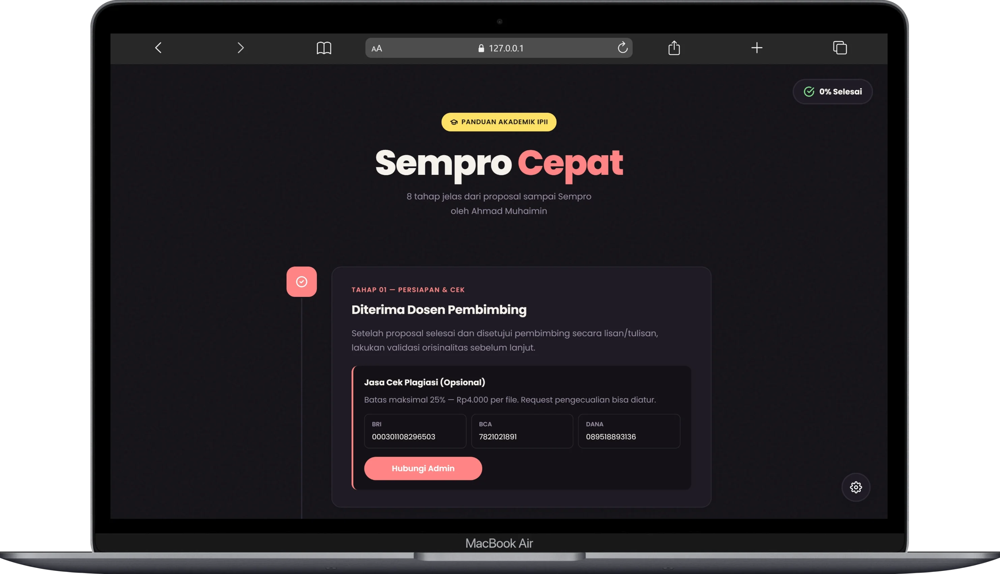

# Sempro Cepat - Panduan Akademik IPII

Ini adalah sebuah halaman web statis interaktif yang berfungsi sebagai panduan langkah-demi-langkah untuk mahasiswa IPII (Ilmu Perpustakaan dan Informasi Islam) dalam menyelesaikan Seminar Proposal (Sempro).

Proyek ini dibuat dengan HTML, CSS, dan JavaScript murni (vanilla) tanpa menggunakan framework atau library eksternal.

## Preview

## Fitur Utama

- **Timeline Interaktif:** 8 tahap yang jelas dari persiapan hingga pasca-seminar.
- **Dark/Light Mode:** Tampilan yang nyaman dibaca kapan saja, dengan preferensi yang tersimpan otomatis.
- **Floating Action Menu (FAB):** Akses cepat untuk navigasi (ke atas/bawah), ganti tema, dan kontrol musik.
- **Musik Latar & Efek Suara:** Musik instrumental untuk menemani membaca dan efek suara UI untuk interaksi yang lebih hidup.
- **Desain Responsif:** Tampilan optimal di berbagai perangkat, dari desktop hingga mobile.
- **Animasi Halus:** Transisi dan animasi yang membuat antarmuka lebih menarik.

## Live

Anda bisa mengakses versi live dari proyek ini di:
**https://sempro-cepat-ipii.vercel.app/**

## Teknologi yang Digunakan

- HTML5
- CSS3 (dengan CSS Variables untuk theming)
- JavaScript (Vanilla JS)
